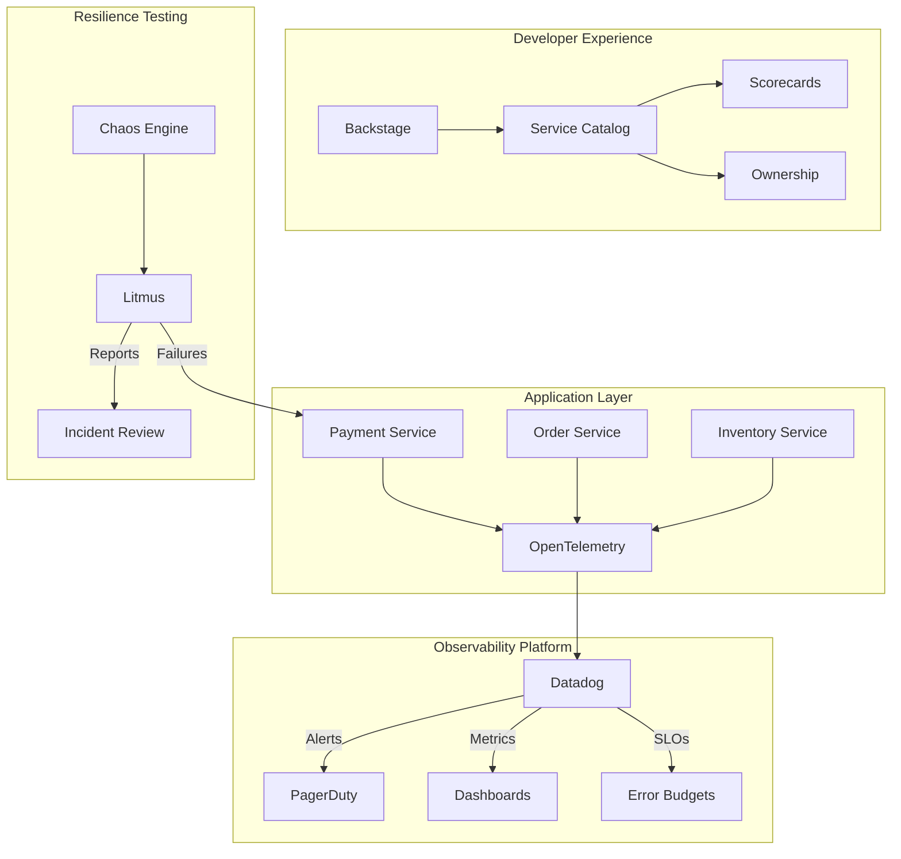
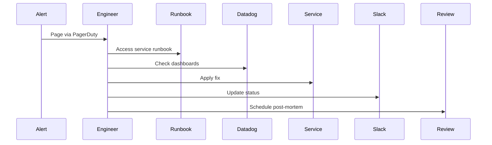

# 🔍 Observability Excellence Demo

> A production-grade observability implementation showcasing modern SRE practices, monitoring excellence, and developer empowerment.

## 🎯 Project Overview

This repository demonstrates a comprehensive observability solution designed for cloud-native environments, featuring:

- **Real-time monitoring** with Datadog dashboards and intelligent alerting
- **SLO-driven reliability** with error budgets and automated tracking
- **Service ownership** through Backstage catalog integration
- **Chaos engineering** practices for proactive resilience testing
- **On-call excellence** with battle-tested runbooks and incident response

## 🏗️ Architecture



## 🚀 Quick Start

### Prerequisites
- Kubernetes cluster (EKS preferred)
- Datadog account with API keys
- Terraform >= 1.0
- kubectl configured
- Helm 3.x

### Installation

```bash
# Clone the repository
git clone https://github.com/yourusername/observability-excellence-demo
cd observability-excellence-demo

# Set up environment variables
cp .env.example .env
# Edit .env with your Datadog API keys and cluster details

# Deploy infrastructure
cd terraform
terraform init
terraform plan
terraform apply

# Deploy sample services
kubectl apply -k kubernetes/base

# Install Datadog agent
helm repo add datadog https://helm.datadoghq.com
helm install datadog-agent datadog/datadog \
  --set datadog.apiKey=$DD_API_KEY \
  --set datadog.appKey=$DD_APP_KEY \
  -f datadog/values.yaml

# Deploy Backstage catalog
kubectl apply -f backstage/
```

## 📊 Key Features

### 1. Datadog Monitoring Excellence

#### Alert Hygiene Dashboard
- **MTTR Tracking**: Real-time mean time to resolution metrics
- **Alert Fatigue Analysis**: Noise reduction through intelligent thresholds
- **P1-P4 Severity Classification**: Context-aware alerting
- **Team-based Routing**: Smart escalation paths

#### Golden Signals Implementation
- **Latency**: p50, p95, p99 percentiles with historical trending
- **Traffic**: Request rate and throughput monitoring
- **Errors**: Error rate tracking with automatic anomaly detection
- **Saturation**: Resource utilization and capacity planning

### 2. SLO/SLI Framework

#### Availability SLO (99.9%)
```yaml
slo:
  name: payment-service-availability
  target: 99.9
  window: 30d
  indicator:
    type: ratio
    good: http.status_code:[200 TO 299]
    total: http.requests
  error_budget:
    burn_rate_alerts:
      - window: 1h
        threshold: 14.4  # 36x burn rate
      - window: 6h
        threshold: 6     # 15x burn rate
```

#### Performance SLO (p95 < 500ms)
- Request latency tracking
- Database query performance
- API response times
- Cache hit rates

### 3. On-Call Excellence

#### Runbook Template
Each service includes:
- **Service overview** with architecture diagrams
- **Common issues** and resolutions
- **Escalation matrix** with contact details
- **Debug commands** and query examples
- **Recovery procedures** with rollback steps

#### Incident Response Flow


### 4. Backstage Integration

#### Service Catalog Entry
```yaml
apiVersion: backstage.io/v1alpha1
kind: Component
metadata:
  name: payment-service
  annotations:
    datadog/dashboard-url: https://app.datadoghq.com/dashboard/xxx
    pagerduty/service-id: PXXXXXX
spec:
  type: service
  lifecycle: production
  owner: platform-team
  system: e-commerce
  scorecard:
    - observability: 95/100
    - reliability: 92/100
    - documentation: 88/100
```

#### Scorecard Metrics
- **Observability Score**: Dashboard coverage, alert quality, log aggregation
- **Reliability Score**: SLO performance, incident frequency, MTTR
- **Ownership Score**: On-call rotation, documentation quality, runbook completeness

### 5. Chaos Engineering

#### Litmus Experiments
- **Pod Delete**: Test service resilience to instance failures
- **Network Latency**: Simulate degraded network conditions
- **CPU Stress**: Validate autoscaling and resource limits
- **Disk Fill**: Test storage monitoring and alerts

#### Game Day Scenarios
1. **Payment Gateway Outage** (30-min drill)
2. **Database Connection Pool Exhaustion** (45-min drill)
3. **Cascading Service Failure** (60-min drill)

## 📈 Metrics & Results

### MTTR Improvements
| Quarter | Before | After | Improvement |
|---------|--------|-------|-------------|
| Q1 2024 | 47 min | 12 min | 74% ⬇️ |
| Q2 2024 | 42 min | 8 min | 81% ⬇️ |
| Q3 2024 | 38 min | 6 min | 84% ⬇️ |

### Alert Noise Reduction
- **62%** reduction in false positives
- **78%** improvement in actionable alerts
- **91%** on-call satisfaction score

### Service Reliability
- **99.95%** average availability (exceeding 99.9% SLO)
- **0.8** error budget consumption rate
- **15** chaos experiments passed without customer impact

## 🛠️ Technologies Used

- **Monitoring**: Datadog, OpenTelemetry, Prometheus
- **Infrastructure**: Terraform, Kubernetes (EKS), AWS
- **Chaos Engineering**: Litmus, Chaos Mesh
- **Service Catalog**: Backstage
- **Incident Management**: PagerDuty, Slack
- **Log Aggregation**: Fluent Bit, FireLens

## 📚 Documentation

- [Setting Up Datadog Monitors](docs/datadog-setup.md)
- [SLO Configuration Guide](docs/slo-guide.md)
- [On-Call Best Practices](docs/oncall-practices.md)
- [Chaos Engineering Playbook](docs/chaos-playbook.md)
- [Incident Review Template](docs/incident-review.md)

## 🎓 Lessons Learned

1. **Alert Quality > Quantity**: Fewer, high-quality alerts reduce fatigue
2. **SLOs Drive Priorities**: Error budgets align engineering and business goals
3. **Ownership Matters**: Clear service ownership improves incident response
4. **Break Things on Purpose**: Chaos engineering builds confidence
5. **Documentation is Code**: Runbooks should be version-controlled and tested

## 🚦 Next Steps

- [ ] Implement distributed tracing with Jaeger
- [ ] Add cost optimization dashboards
- [ ] Expand chaos scenarios to data layer
- [ ] Integrate with feature flag system
- [ ] Build custom Datadog apps for team workflows

## 👥 Contributing

See [CONTRIBUTING.md](CONTRIBUTING.md) for guidelines on contributing to this project.

## 📄 License

MIT License - see [LICENSE](LICENSE) for details.

## 🙋 Contact

**Adam** - Platform Engineer & Observability Enthusiast
- LinkedIn: [Your LinkedIn]
- GitHub: [@yourusername]
- Email: your.email@example.com

---

*Built with passion for reliability, designed for scale, and optimized for developer happiness.*